# OT/ICS Mini-Lab: Modbus Traffic Analysis and Detection

This is a small OT/ICS lab. A PLC runs a simulated milk pasteurizer, I attack it over
Modbus, and a passive monitor detects the attack.

I built it to learn OT network monitoring the way it actually works: baseline the normal
traffic first, then catch the thing that does not fit.

## Architecture

```
      plant.py            Node-RED HMI           attack.py
     (physics)             (operator)           (attacker)
         |                     |                     |
         | writes              | setpoints           | unauthorized
         | temp/level          | + reads             | write
         v                     v                     v
   +--------------------------------------------------------+
   |     OpenPLC  -  control logic, Modbus server :502       |
   +--------------------------------------------------------+
                              |
                              |  all :502 traffic mirrored to the sensor
                              v
               +---------------------------------+
               |    Zeek + ICSNPP + detect.zeek  |
               |   passive: writes logs, alerts  |
               +---------------------------------+
```

Five parts, one host (everything on 127.0.0.1):
- **OpenPLC** runs the control logic and is the Modbus TCP server on `:502`.
- **plant.py** simulates the physics (temperature, level) so the plant behaves.
- **Node-RED** is the operator HMI and the source of normal write traffic.
- **Zeek** (with the ICSNPP-Modbus parser) is the passive sensor. It turns the traffic
  into structured logs and runs the detection.
- **attacker/attack.py** sends the unauthorized write.

## The process: the milk pasteurizer

The plant is a batch milk pasteurizer. It fills the vat, heats the milk to 63 C, holds it
there for the hold time, then releases the batch only if the hold was met. If the hold was
not met, it diverts the batch instead. The rule: under-pasteurized milk must
never leave the vat.

I picked a pasteurizer for three reasons. It is a real, well documented process. Food and
beverage is an OT sector. And it has a real safety consequence, so the attack is not
abstract, beating the control means shipping unsafe milk.

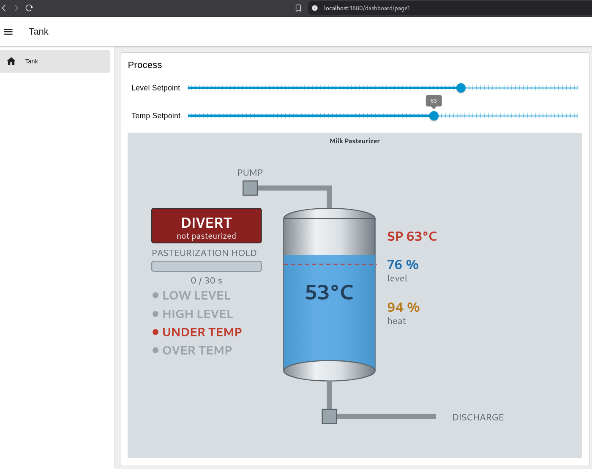
*The operator HMI (Node-RED). Normal run: setpoint 63, milk heating, DIVERT until the hold is met.*

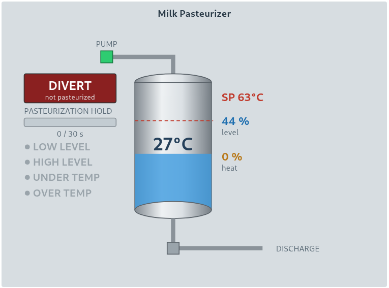
*Fill phase: the pump runs and the vat fills before heating starts.*

## Control logic

- State machine: Fill -> Cook -> Hold -> Empty, then repeat.
- Temperature: PI controller with anti-windup, holds 63 C at about 55% power.
- Hold: a 30 s timer that resets if the temperature drops
- Alarms and interlocks: low/high level, over/under temp, dry-fire interlock.
- Full register/coil map: `docs/tag-map.md`.

The control core: the PI temperature block, the 30 s hold timer, the ET to HoldSecs
conversion, and the Cooking/Emptying state latches.

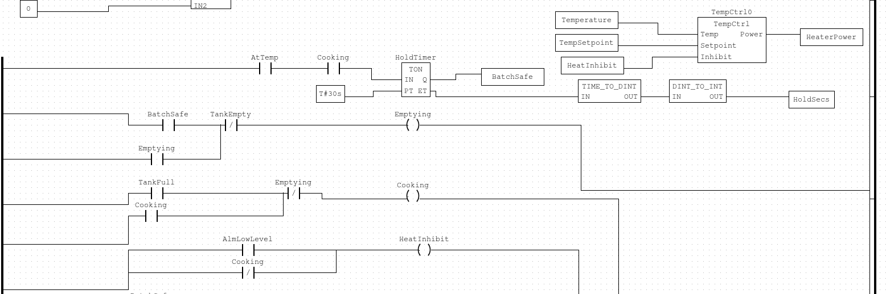

The temperature controller, an anti-windup PI in Structured Text:

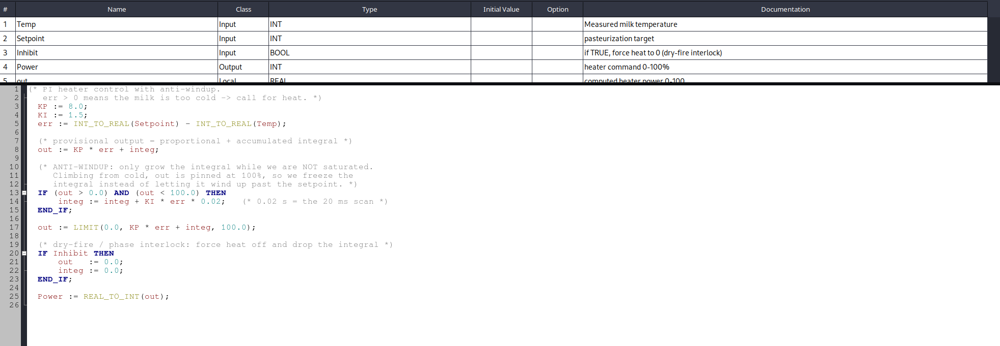

The batch outputs (Divert fail-safe, Discharge, the Pump seal-in), the setpoint bands,
and the alarms:

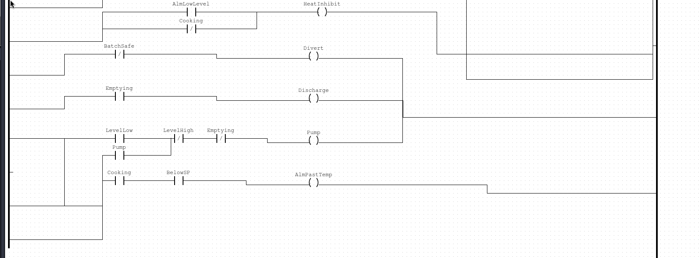
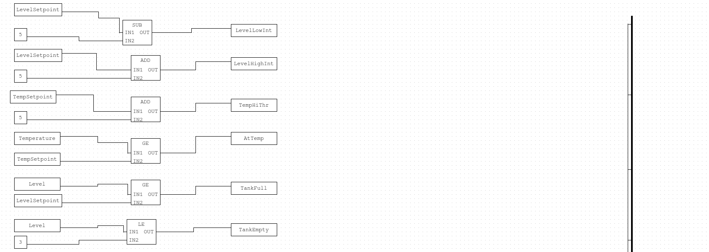
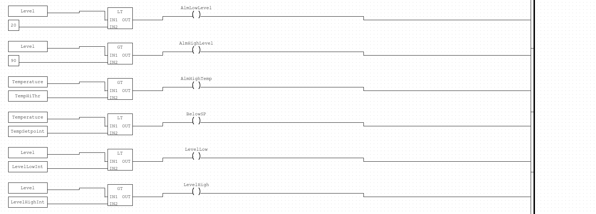

## The security story

### 1. Baseline: what normal looks like

Before you can detect anything, you have to know what normal traffic looks like.

- Captured the live Modbus traffic on loopback (`captures/normal-clean.pcap`).
- Only three function codes appear: read coils (FC1), read registers (FC3), write single
  register (FC6).
- The plant writes only regs 0-1. The operator writes only regs 2-3. Nobody writes any
  coil. Nobody writes the read-only regs 4-5.
- Details and the reasoning: `docs/baseline.md`.

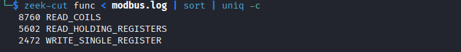
*Zeek's view of normal traffic: only read-coils, read-registers, and write-single-register appear.*

### 2. Attack

The attack assumes the attacker is already on the OT network. That is the realistic
starting point. Once there, Modbus does the rest, because it has no authentication or encryption.
Any host that can reach the PLC can send commands and the PLC obeys.

The attack lowers `TempSetpoint` below 63. The control logic checks temperature against
that setpoint, so with a low setpoint the batch reaches "at temperature", the hold
completes, and the vat discharges. The milk only got to about 30 C, but the HMI still
shows BATCH SAFE. The plant ships unsafe milk and believes it is fine. Script:
`attacker/attack.py`.

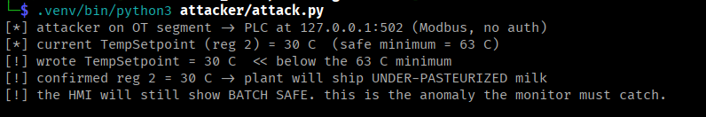
*The attack: one Modbus write forces TempSetpoint to 30, below the 63 C minimum.*

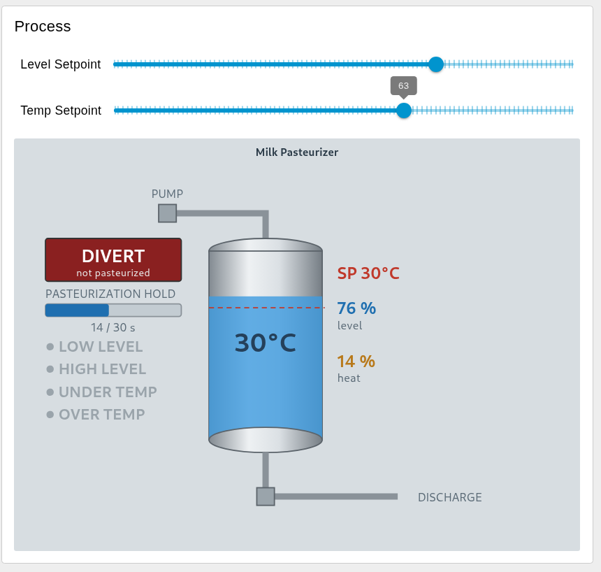
*The HMI with the setpoint forced to 30: the batch "cooks" to only 30 C.*

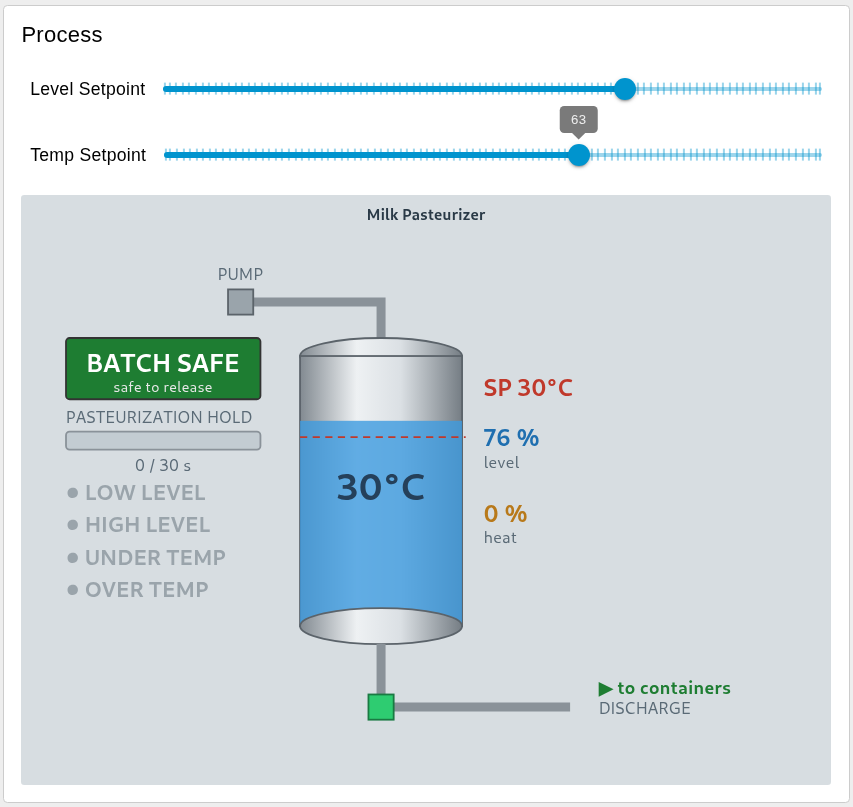
*The consequence: BATCH SAFE (green) while discharging 30 C milk to containers.*

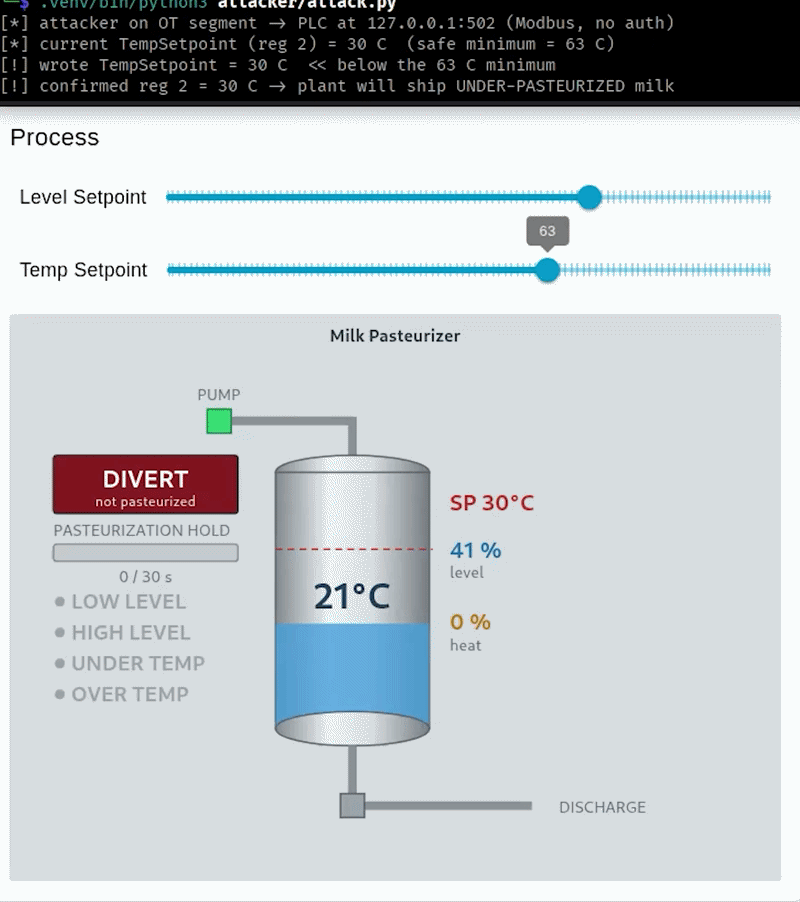

### 3. Detection

- Zeek + `detection/detect.zeek` flags writes that break the baseline.
- Validated the right way: clean traffic = 0 alerts, attack = 1 alert.
- The alert carries the why:
  `TempSetpoint (reg 2) set to 30 C, below the 63 C minimum, from 127.0.0.1:<port>`.
- The ICSNPP-Modbus parser adds `modbus_detailed.log`, which records every write with its
  register and value, so the malicious write is visible in the forensic log too.

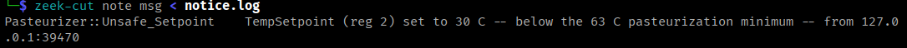
*The alert: Zeek's notice.log flags the unsafe setpoint write with the reason attached.*

### 4. What I learned: baselining is the hard part

My first detection rule looked obvious: alert if someone writes the temperature setpoint
below 63. It fired on normal operation.

The reason was the HMI. The setpoint slider sent a Modbus write on every step as I dragged
it, so a normal setpoint change streamed values like 43, 44, 45 on the way up to 63. My
rule flagged all of them. About twenty false alarms on legitimate operator activity.

The real problem was the data, not the rule. A real HMI commits a setpoint, it does not
broadcast every intermediate value. I changed the slider to send only the final value,
captured clean traffic again, and confirmed zero alerts. Then I ran the same rule on the
attack and got exactly one alert.

That is the lesson. At the protocol level the attacker's write and a normal operator write
look identical. You cannot tell them apart from the packet. You can only tell them apart if
you know what normal looks like first.

## Key concepts

- Modbus has no authentication or encryption. The PLC runs any well-formed request without
  checking who sent it.
- Reachability is control. This lab starts after the network is already breached. Keeping
  attackers off the OT segment is the other half of the defense.
- Because the protocol will not defend itself, the defense is a passive monitor that
  watches the traffic and flags anything that does not match the baseline.

## Repo layout

```
plc/            OpenPLC control logic (ladder + ST), tag map
process-sim/    plant.py (the physics)
hmi/            Node-RED flow (the operator HMI)
attacker/       attack.py (the unauthorized write)
detection/      detect.zeek + Zeek output logs
captures/       pcaps: normal-baseline, normal-clean, attack
docs/           tag-map, baseline, running-zeek
screenshots/    ladder logic and HMI images
```

## How to run it

Everything runs on one host. Start the three pieces, then capture, attack, and detect.

First-time setup for the Python parts (the plant and the attack):
```
python3 -m venv .venv
.venv/bin/pip install -r requirements.txt
```

Then:
1. Start OpenPLC, load the tank program (`plc/tank/`), Start PLC. Set Temp 63, Level 60
   on the HMI.
2. Run the plant: `.venv/bin/python3 process-sim/plant.py`
3. Start Node-RED, import `hmi/flow.json`, open the dashboard (`localhost:1880/dashboard`).
4. Capture, attack, and detect: see `docs/running-zeek.md`.

## Limitations and next steps

Everything runs on one host over loopback. A real plant would be separate machines on a
segmented network, and the source of a write would be a different IP. Here the attacker is
just another process on the same host, which stands in for a machine already on the OT
segment.

The detector keys on a value rule: setpoint below 63. That works for this process, but a
production detector would also key on the source of the write and whether the value stays
bad, not just that one write went low.
