# OT/ICS Mini-Lab: Modbus Traffic Analysis and Detection

This is a small OT/ICS lab. A PLC runs a simulated milk pasteurizer, an attacker on the
network changes a setpoint over Modbus, and a passive monitor detects the attack.

I built it to learn how an industrial control system works, how it fails, and how passive
network monitoring can catch an attack on it.

## How I built it

I designed the scenario (the pasteurizer, the attack, and what to detect) and wrote the
PLC ladder logic in OpenPLC, with AI help. I built the rest with AI coding tools (Claude
Code): the Structured Text PI temperature controller, the Python process model, the
Node-RED HMI, the attack script, and the Zeek detection. I understand how all of it works,
but I did not hand-write those parts.

## Architecture

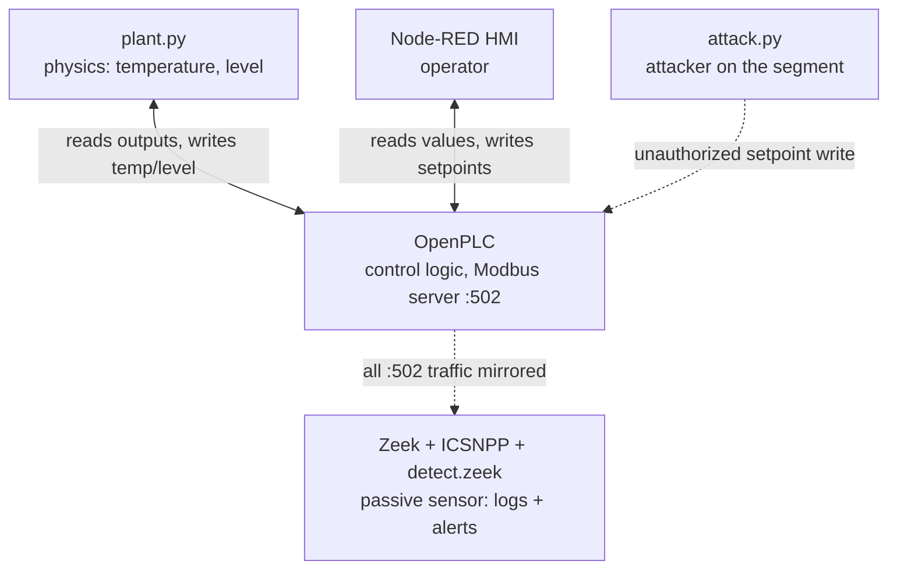
```mermaid
flowchart TD
    plant["plant.py<br/>physics: temperature, level"]
    plc["OpenPLC<br/>control logic, Modbus server :502"]
    hmi["Node-RED HMI<br/>operator"]
    atk["attack.py<br/>attacker on the segment"]
    zeek["Zeek + ICSNPP + detect.zeek<br/>passive sensor: logs + alerts"]

    plant <-->|reads outputs, writes temp/level| plc
    hmi <-->|reads values, writes setpoints| plc
    atk -.->|unauthorized setpoint write| plc
    plc -.->|all :502 traffic mirrored| zeek
```

Five parts, one host (everything on 127.0.0.1):
- **OpenPLC** runs the control logic and is the Modbus TCP server on `:502`.
- **plant.py** simulates the physics, so temperature and level move the way they would
  on a real vat.
- **Node-RED** is the operator HMI and the source of normal write traffic.
- **Zeek** is the passive sensor, running the ICSNPP-Modbus parser (an open source Modbus
  parser from Idaho National Lab and CISA). It turns the traffic into structured logs and
  runs the detection.
- **attacker/attack.py** sends the unauthorized write.

## The process: the milk pasteurizer

The plant is a batch milk pasteurizer. It fills the vat, heats the milk to 63 C, holds it
there for the hold time, then releases the batch only if the hold was met. If the hold was
not met, it diverts the batch instead. Under-pasteurized milk must never leave the vat.

I picked a pasteurizer because it is a well documented process in a real OT sector, and
because the attack has a physical consequence. If you beat the control, the plant ships
milk that was never pasteurized.

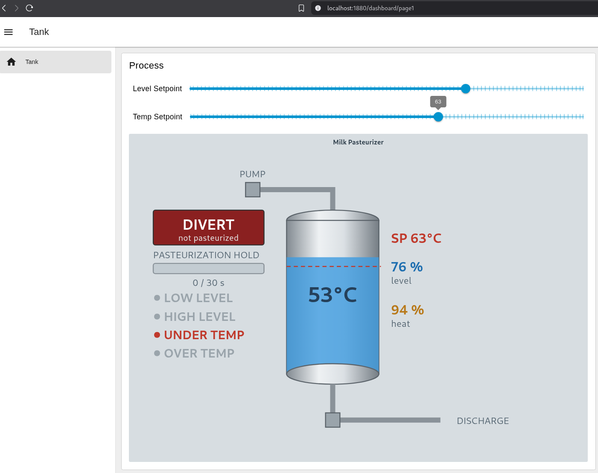
*The operator HMI (Node-RED). Normal run: setpoint 63, milk heating, DIVERT until the hold is met.*

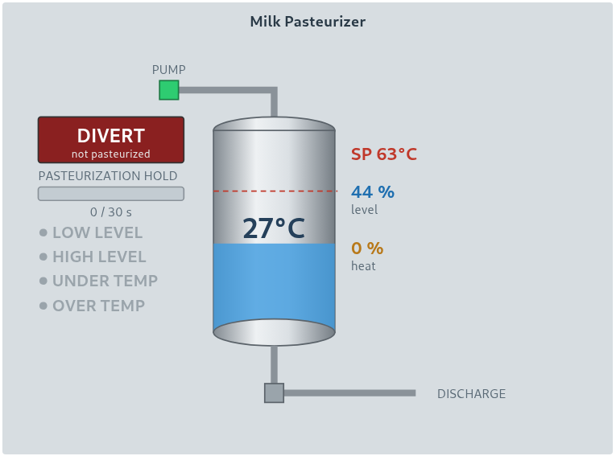
*Fill phase: the pump runs and the vat fills before heating starts.*

## Control logic

- State machine: Fill -> Cook -> Hold -> Empty, then repeat.
- Temperature: PI controller with anti-windup, holds 63 C at about 55% power.
- Hold: a 30 s timer that resets if the temperature drops. (A real vat pasteurizer holds
  63 C for 30 minutes. The lab shortens it to 30 s.)
- Alarms and interlocks: low/high level, over/under temp, dry-fire interlock.
- Full register/coil map: `docs/tag-map.md`.

The control core is the PI temperature block, the 30 s hold timer, the elapsed-time to
HoldSecs conversion, and the Cooking/Emptying state latches.

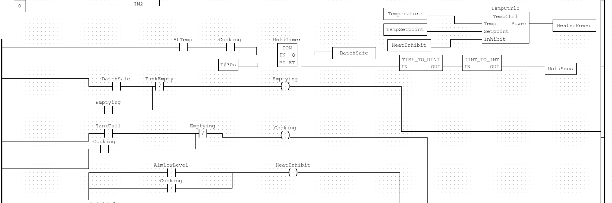

The temperature controller, an anti-windup PI block in Structured Text (written with AI,
see "How I built it"):

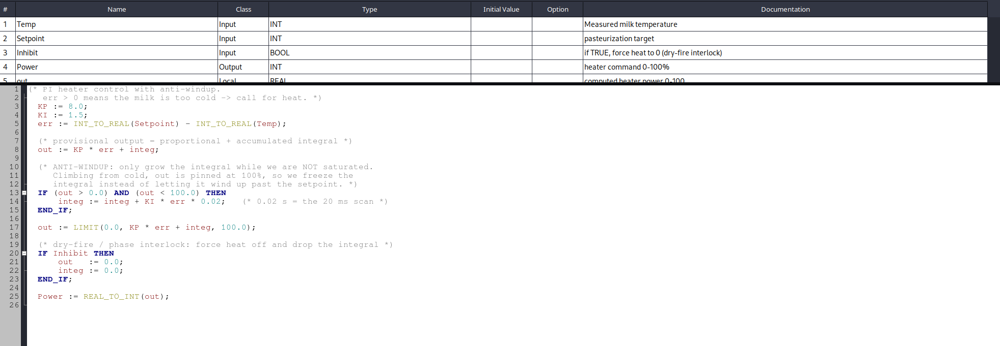

The batch outputs (Divert fail-safe, Discharge, the Pump seal-in), the setpoint bands,
and the alarms:

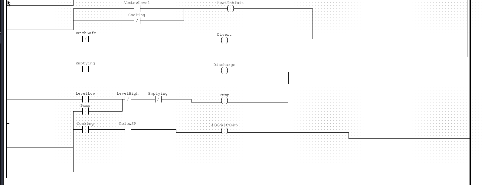
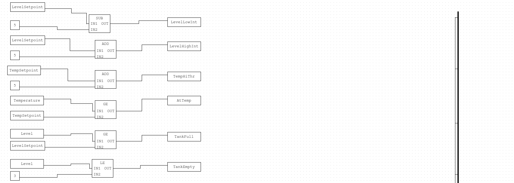
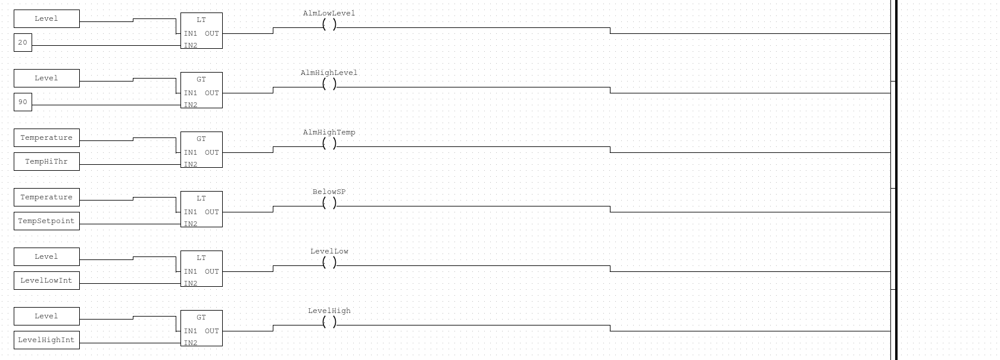

## The security story

### 1. Baseline: what normal looks like

Before you can detect anything, you have to know what normal traffic looks like.

- Captured the live Modbus traffic on loopback (`captures/normal-clean.pcap`).
- Only three function codes appear: read coils (FC1), read registers (FC3), write single
  register (FC6).
- The plant writes only regs 0-1. The operator writes only regs 2-3. Nobody writes any
  coil. Nobody writes the read-only regs 4-5.
- Details and the reasoning: `docs/baseline.md`.


*Zeek's view of normal traffic: only read-coils, read-registers, and write-single-register appear.*

### 2. Attack

The attack assumes the attacker is already on the OT network. That is the realistic
starting point. From there nothing in the protocol stops them, because Modbus has no
authentication or encryption. Any host that can reach the PLC can send commands and the
PLC obeys.

The attack lowers `TempSetpoint` below 63. The control logic checks temperature against
that setpoint, so with a low setpoint the batch reaches "at temperature", the hold
completes, and the vat discharges. The milk only got to about 30 C, but the HMI still
shows BATCH SAFE, so the plant ships unsafe milk. Script: `attacker/attack.py`.

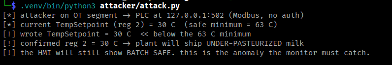
*The attack: one Modbus write forces TempSetpoint to 30, below the 63 C minimum.*

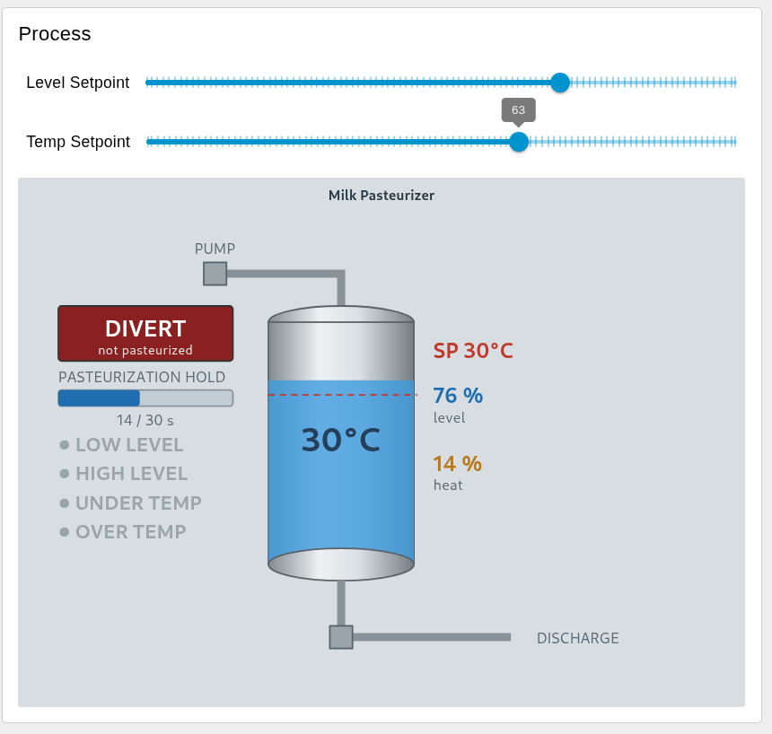
*The HMI with the setpoint forced to 30: the batch "cooks" to only 30 C.*

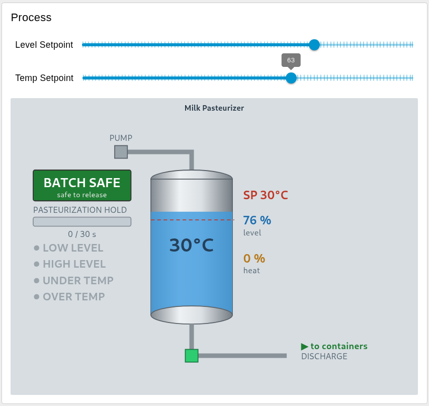
*The consequence: BATCH SAFE (green) while discharging 30 C milk to containers.*

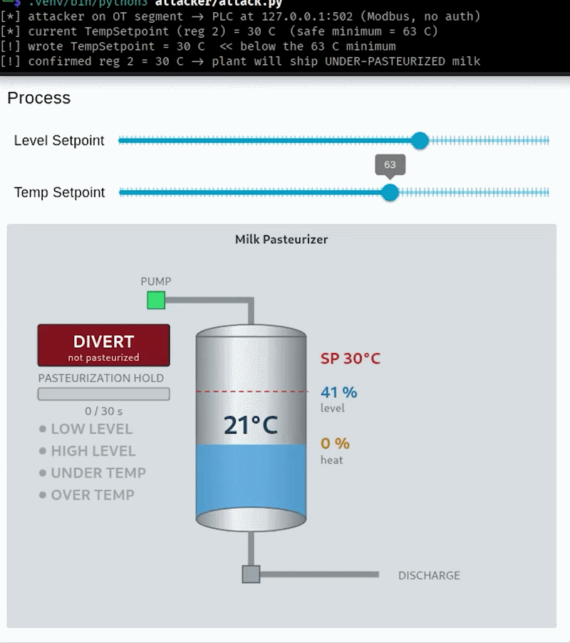

### 3. Detection

- Zeek + `detection/detect.zeek` flags writes that break the baseline.
- Validated on both captures: clean traffic gives 0 alerts, the attack gives 1.
- The alert includes the reason:
  `TempSetpoint (reg 2) set to 30 C, below the 63 C minimum, from 127.0.0.1:<port>`.
- The ICSNPP-Modbus parser adds `modbus_detailed.log`, which records every write with its
  register and value, so the malicious write is visible in the forensic log too.

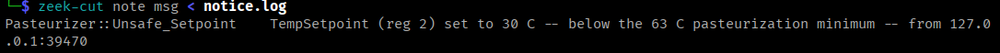
*The alert: Zeek's notice.log flags the unsafe setpoint write with the reason attached.*

### 4. Baselining was the hard part

The first detection rule looked obvious: alert if anyone writes the temperature setpoint
below 63. It fired on normal operation.

The cause was the HMI. The setpoint slider sent a Modbus write on every step while it was
dragged, so a normal setpoint change streamed values like 43, 44, 45 on the way up to 63.
The rule flagged all of them, about twenty false alarms on legitimate operator activity.

The real problem was the data, not the rule. A real HMI sends the setpoint once it is
committed. It does not broadcast every intermediate value. After the slider was changed to
send only the final value, a new clean capture gave zero alerts, and the same rule on the
attack gave exactly one.

At the protocol level the attacker's write and a normal operator write are the same
message. Telling them apart depends on knowing which registers the HMI normally writes
and what values it sends.

## Key concepts

- Modbus has no authentication or encryption. The PLC runs any well-formed request without
  checking who sent it.
- This lab starts after the network is already breached. Keeping attackers off the OT
  segment is the other half of the defense, and it is not covered here.
- Since the protocol cannot check the sender, the monitoring has to. A passive sensor
  watches the traffic and flags anything that does not match the baseline.

## Repo layout

```
plc/tank/       OpenPLC project for the pasteurizer (ladder + the ST PI block)
plc/motor.st    a start/stop seal-in test program
process-sim/    plant.py (the physics)
hmi/            Node-RED flow (the operator HMI)
attacker/       attack.py (the unauthorized write)
detection/      detect.zeek + Zeek output logs
captures/       pcaps: normal-baseline, normal-clean, attack
docs/           tag-map, baseline, running-zeek
screenshots/    ladder logic and HMI images
```

## How to run it

Everything runs on one host. Start the three running pieces (PLC, plant, HMI), then
capture, attack, and detect.

First-time setup for the Python parts (the plant and the attack):
```
python3 -m venv .venv
.venv/bin/pip install -r requirements.txt
```

Then:
1. Start OpenPLC, load the tank program (`plc/tank/`), Start PLC. Set Temp 63, Level 60
   on the HMI.
2. Run the plant: `.venv/bin/python3 process-sim/plant.py`
3. Start Node-RED, import `hmi/flow.json`, open the dashboard (`localhost:1880/dashboard`).
4. Capture, attack, and detect: see `docs/running-zeek.md`.

## Limitations

Everything runs on one host over loopback. A real plant would be separate machines on a
segmented network, and the source of a write would be a different IP. Here the attacker is
just another process on the same host, which stands in for a machine already on the OT
segment.

The detector uses a value rule, setpoint below 63. That works for this process, but a
production detector would also check the source of the write and whether the value stays
bad, rather than firing on a single low write.
